# README — Ansible Task Execution

## Task Objective

Automate the setup of a remote Ubuntu VM using **Ansible** to:

* Install and configure **Nginx**
* Install and configure **MySQL** and **PostgreSQL**
* Create DB users and seed sample data via Ansible
* Install **Docker** and initialize **Docker Swarm**
* Identify DB log locations
* Configure and test **log rotation** for DB logs using Ansible

---

## Environment

* **OS**: Ubuntu Server (EC2)
* **Instance type**: t2.micro
* **Provisioning**: Terraform
* **Configuration**: Ansible (local controller, static inventory)

---

## Implementation Summary

### 1. VM Provisioning (Terraform)

* EC2 instance created using Terraform
* Default VPC and subnet used
* SSH and HTTP ports allowed

📸 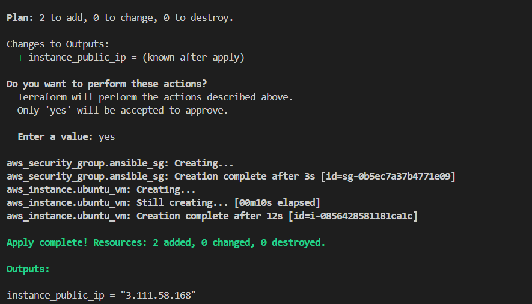

---

### 2. Nginx (Ansible)

* Installed and configured via `nginx.yml`
* Custom index page deployed
* Service started and enabled

📸 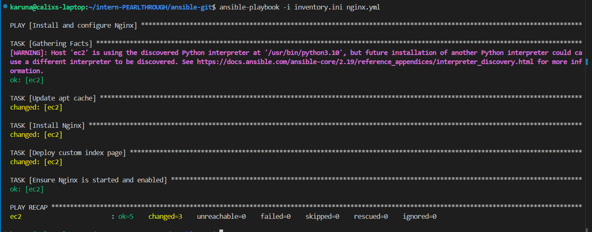
    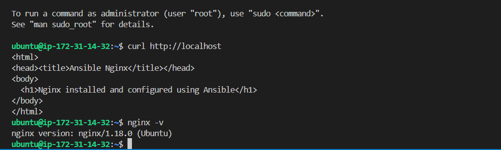

---

### 3. MySQL (Ansible)

* Installed via `mysql.yml`
* Database and user created
* Sample table and data seeded via Ansible

📸 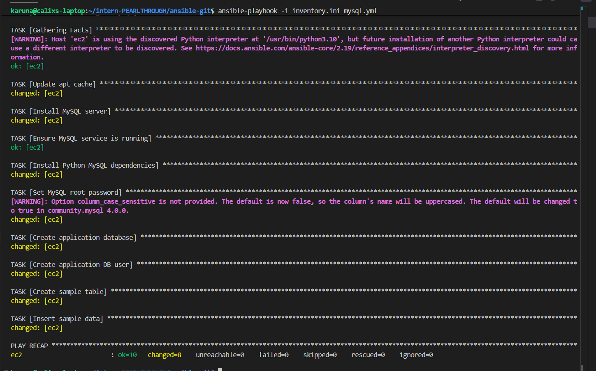
    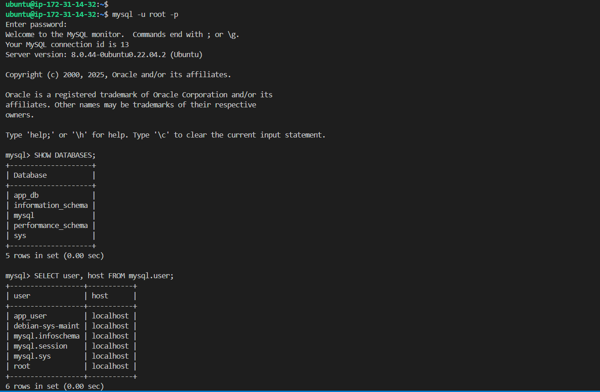
    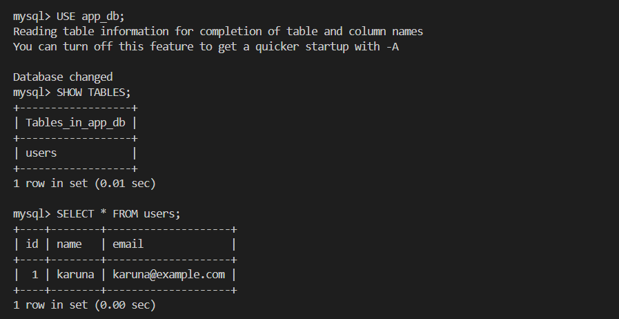

---

### 4. PostgreSQL (Ansible)

* Installed via `postgres.yml`
* Database and user created
* Sample data seeded using SQL seed file

📸 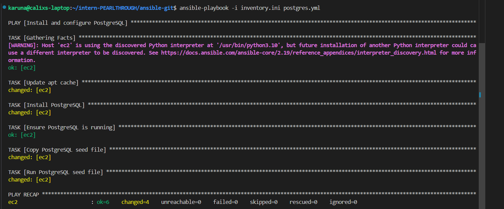
    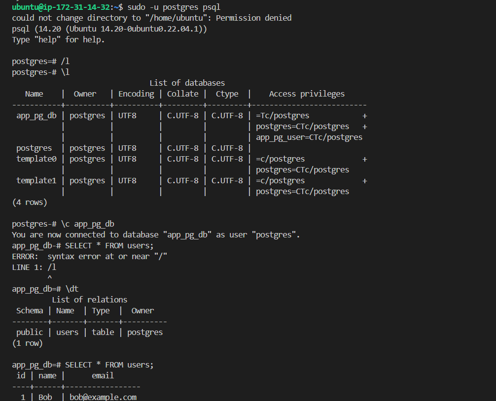

---

### 5. Docker & Docker Swarm (Ansible)

* Docker installed and enabled
* Docker Swarm initialized (single-node manager)

📸 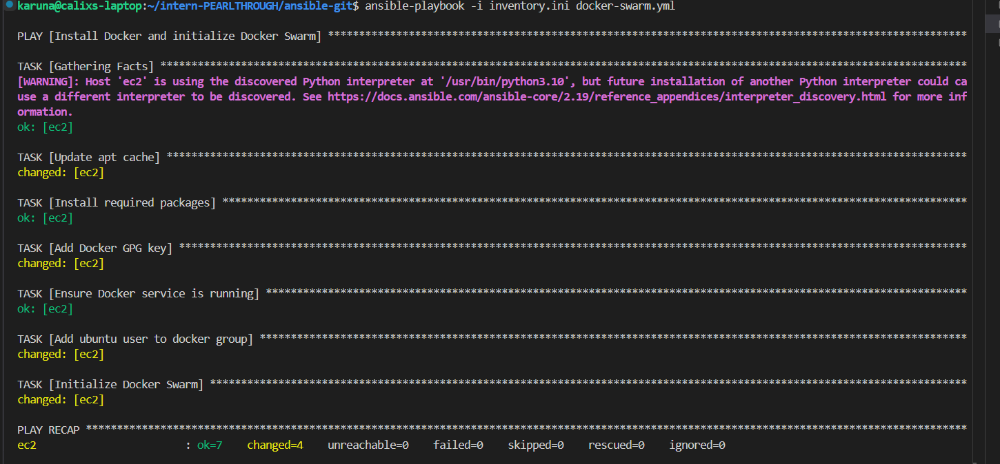
   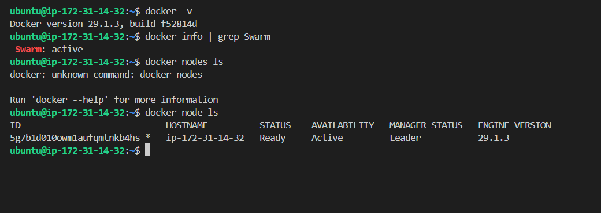

---

### 6. Logs & Log Rotation (Ansible)

**Log Locations**

* Nginx: `/var/log/nginx/`
* MySQL: `/var/log/mysql/`
* PostgreSQL: `/var/log/postgresql/`
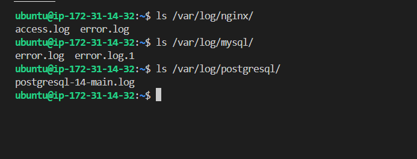

**Log Rotation**

* Configured for MySQL and PostgreSQL using Ansible
* Rotation tested by forcing logrotate

📸 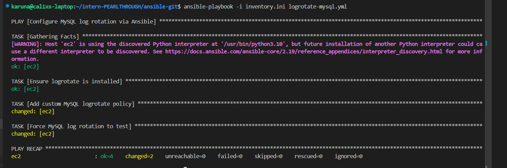
    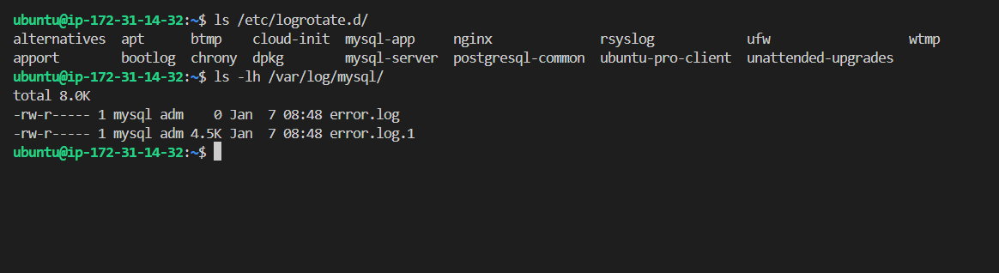

---

## Result

All services were installed, configured, and verified using automation only.
Database users, seed data, and log rotation were handled entirely via Ansible.

---

### ✔ Task Status: **Completed**
